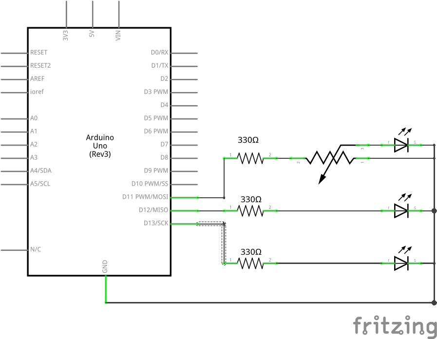

# Arduino: LED Demo

Arduino sketch which controls 3 simple LED circuits in order to demonstrate the system as a whole.

## LED Demonstrations

| Pin Number | Behaviour |
| -- | --- |
| 13 | Always on |
| 12 | Pseudo-analog loop between 0% brightness and 100% brightness |
| 11 | Controllable by the connected potentiometer |

## Schematic

